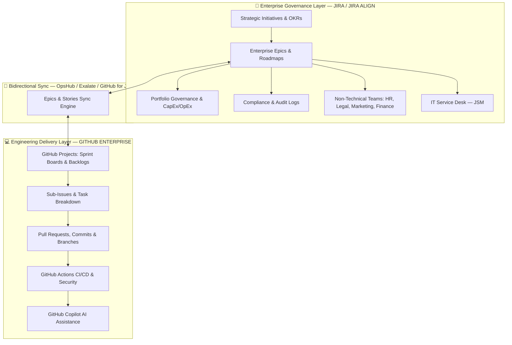

# Atlassian JIRA vs GitHub Projects — Enterprise Comparison Report

**Prepared:** October 2026 | **Scope:** Feature Comparison & Migration Feasibility for 35,000 Users

---

## Executive Verdict

> [!CAUTION]
> **A wholesale "Big Bang" migration of 35,000 users from Atlassian JIRA to GitHub Projects is NOT recommended.** GitHub Projects is an excellent engineering delivery tool but lacks the enterprise portfolio management, compliance, ITSM, and non-technical team capabilities required at this scale. The recommended approach is a **Two-Tier Hybrid Coexistence Model**.

---

## Table of Contents

1. [Platform Overview](#1-platform-overview)
2. [Feature-by-Feature Comparison](#2-feature-by-feature-comparison)
3. [What Works in GitHub Projects](#3-what-works-in-github-projects)
4. [What Does NOT Work in GitHub Projects](#4-what-does-not-work-in-github-projects)
5. [Hard Limits & Scalability](#5-hard-limits--scalability)
6. [Pricing & Total Cost of Ownership](#6-pricing--total-cost-of-ownership)
7. [Compliance, Audit & Security](#7-compliance-audit--security)
8. [ITSM / Service Management](#8-itsm--service-management)
9. [Marketplace & Plugin Ecosystem](#9-marketplace--plugin-ecosystem)
10. [Real-World Migration Case Studies](#10-real-world-migration-case-studies)
11. [Migration Tools & Pain Points](#11-migration-tools--pain-points)
12. [35,000-User Migration Suitability Assessment](#12-35000-user-migration-suitability-assessment)
13. [Strategic Recommendation](#13-strategic-recommendation)

---

## 1. Platform Overview

| Dimension | Atlassian JIRA (2026) | GitHub Projects (v2, 2026) |
| :--- | :--- | :--- |
| **Core Identity** | Enterprise Agile Planning & Work Management platform | Developer-centric project tracking layer inside GitHub |
| **Target Users** | Software teams, IT ops, business teams (HR, Legal, Marketing, Finance) | Software engineers, DevOps, product managers |
| **Architecture** | Standalone SaaS; unified Jira Software + Work Management | Metadata/visualization layer over GitHub Issues & PRs |
| **Hierarchy** | Epic → Story → Subtask (+ Initiative/Theme via Plans/Align) | Sub-issues (100 per parent, 8 levels deep) + Dependencies |
| **Gartner Classification** | **Leader** in Enterprise Agile Planning (EAP) | Evaluated in DevOps Platforms only; **not rated** in EAP |

---

## 2. Feature-by-Feature Comparison

### 2.1 Views & Boards

| Feature | JIRA | GitHub Projects | Verdict |
| :--- | :---: | :---: | :--- |
| Scrum Board | ✅ Full | ❌ No native Scrum | **JIRA wins** |
| Kanban Board | ✅ Full with hard WIP limits | ✅ Soft WIP limits (visual only) | **JIRA wins** (enforcement) |
| Table / List View | ✅ | ✅ Excellent spreadsheet UI | **GitHub wins** (speed & UX) |
| Timeline / Roadmap | ✅ (Single-project + Advanced Roadmaps) | ✅ (Date/Iteration-driven) | **Tie** |
| Calendar View | ✅ | ❌ Not available | **JIRA wins** |
| Summary / Dashboard | ✅ Customizable gadget dashboards | ❌ No configurable dashboards | **JIRA wins** |
| Slicing Panel | ❌ | ✅ One-click field slicing | **GitHub wins** |

### 2.2 Agile & Sprint Management

| Feature | JIRA | GitHub Projects | Verdict |
| :--- | :---: | :---: | :--- |
| Sprint Planning & Backlog | ✅ Dedicated sprint backlog | ⚠️ Iterations field (basic) | **JIRA wins** |
| Sprint Capacity Planning | ✅ Story Points / Hours / Count | ⚠️ Number field aggregations only | **JIRA wins** |
| Sprint Rollover | ✅ Automatic | ⚠️ Manual or via Actions | **JIRA wins** |
| Velocity Chart | ✅ Built-in | ❌ Not available | **JIRA wins** |
| Burndown Chart | ✅ Built-in | ❌ Not available (Burn-up only) | **JIRA wins** |
| Cumulative Flow Diagram | ✅ Built-in | ❌ Not available | **JIRA wins** |
| Control / Cycle Time Chart | ✅ Built-in | ❌ Not available | **JIRA wins** |
| Epic / Version Reports | ✅ Built-in | ❌ Not available | **JIRA wins** |

### 2.3 Workflow Engine

| Feature | JIRA | GitHub Projects | Verdict |
| :--- | :---: | :---: | :--- |
| Custom Status Workflows | ✅ Visual state machine designer | ⚠️ Simple status field (no enforcement) | **JIRA wins** |
| Transition Conditions | ✅ (Role-based, field-based) | ❌ Not available | **JIRA wins** |
| Transition Validators | ✅ (Mandatory fields, data checks) | ❌ Not available | **JIRA wins** |
| Post-Functions | ✅ (Auto-assign, field updates) | ⚠️ Via GitHub Actions only | **JIRA wins** |
| Approval Gates | ✅ Built-in | ❌ Not available | **JIRA wins** |

> [!WARNING]
> GitHub Projects has **no workflow enforcement engine**. Any user with write access can move any card to any status. This is a critical gap for regulated industries requiring stage-gate compliance (e.g., "QA must approve before Done").

### 2.4 Custom Fields & Issue Configuration

| Feature | JIRA | GitHub Projects | Verdict |
| :--- | :---: | :---: | :--- |
| Custom Field Types | ✅ 30+ types (cascading, user picker, group picker, etc.) | ⚠️ 5 types (Text, Number, Date, Single Select, Iteration) | **JIRA wins** |
| Fields per Project | ✅ Unlimited (via schemes) | ⚠️ **50 fields max** | **JIRA wins** |
| Org-wide Issue Types | ✅ Full (Bug, Story, Task, Epic, custom) | ✅ Org-level Issue Types (GA) | **Tie** |
| Field Configuration Schemes | ✅ Mandatory/Optional/Hidden per issue type | ❌ Not available | **JIRA wins** |
| Screen Schemes | ✅ Create/Edit/View screens | ❌ Not available | **JIRA wins** |

### 2.5 Hierarchy & Dependencies

| Feature | JIRA | GitHub Projects | Verdict |
| :--- | :---: | :---: | :--- |
| Parent-Child Hierarchy | ✅ Unified `Parent` field | ✅ Sub-issues (100 per parent, 8 levels) | **Tie** |
| Dependency Tracking | ✅ Multiple link types (blocks, duplicates, causes, relates) | ⚠️ "Blocked by" / "Blocking" only | **JIRA wins** |
| Portfolio Hierarchy (5+ levels) | ✅ Jira Plans / Jira Align | ❌ Max 8 levels (no portfolio layer) | **JIRA wins** |
| Cross-Project Dependencies | ✅ Advanced Roadmaps | ❌ Single-org boundary | **JIRA wins** |

### 2.6 Reporting & Analytics

| Feature | JIRA | GitHub Projects | Verdict |
| :--- | :---: | :---: | :--- |
| Built-in Agile Reports | ✅ 10+ report types | ⚠️ Basic Insights (bar, line, burn-up) | **JIRA wins** |
| Custom Dashboards | ✅ Drag-and-drop gadget dashboards | ❌ Not available | **JIRA wins** |
| Cross-Project Reporting | ✅ Atlassian Analytics / Data Lake | ❌ Not available (requires BI export) | **JIRA wins** |
| Natural Language Queries | ✅ AI-powered JQL generation | ⚠️ Copilot-assisted (limited) | **JIRA wins** |
| JQL / Advanced Querying | ✅ Full boolean, temporal, historical | ⚠️ Basic filter syntax only | **JIRA wins** |
| BI Tool Integration | ✅ Data Lake → Tableau / Power BI | ⚠️ GraphQL export → custom BI pipeline | **JIRA wins** |

### 2.7 Automation

| Feature | JIRA | GitHub Projects | Verdict |
| :--- | :---: | :---: | :--- |
| No-Code Automation | ✅ Visual rule builder (Trigger → Condition → Action) | ✅ Built-in default workflows | **JIRA wins** (more powerful) |
| Code-Based Automation | ✅ Forge / Connect apps | ✅ GitHub Actions (superior CI/CD) | **GitHub wins** (CI/CD native) |
| AI Agents | ✅ Atlassian Rovo (Delivery Agent, Triage Agent) | ✅ GitHub Copilot (triage, summarize) | **Tie** |
| Smart Commit Integration | ✅ (`JIRA-123 #close #time 2h`) | ✅ (`fixes #123`, `closes #456`) | **Tie** |

### 2.8 Time Tracking & Resource Management

| Feature | JIRA | GitHub Projects | Verdict |
| :--- | :---: | :---: | :--- |
| Native Time Tracking | ✅ Original/Remaining Estimate + Work Log | ❌ Not available | **JIRA wins** |
| Timesheet / Billing | ✅ Via Tempo (CapEx/OpEx) | ❌ Not available | **JIRA wins** |
| Resource Capacity Planning | ✅ Jira Plans velocity forecasting | ❌ Not available | **JIRA wins** |

> [!IMPORTANT]
> GitHub Projects has **zero native time tracking or financial capitalization features**. This is a critical gap for enterprises tracking R&D tax credits, billable client hours, or CapEx/OpEx accounting.

### 2.9 Permissions & Access Control

| Feature | JIRA | GitHub Projects | Verdict |
| :--- | :---: | :---: | :--- |
| Project-Level Permissions | ✅ 40+ granular permissions | ⚠️ Read / Write / Admin only | **JIRA wins** |
| Issue-Level Security | ✅ Issue Security Schemes | ❌ Not available | **JIRA wins** |
| Field-Level Restrictions | ✅ Field Configuration Schemes | ❌ All fields editable by write users | **JIRA wins** |
| SSO / SCIM | ✅ SAML 2.0, SCIM (Atlassian Guard) | ✅ SAML 2.0, SCIM (EMU) | **Tie** |
| Data Residency | ✅ 12+ regions | ⚠️ US / EU only | **JIRA wins** |

### 2.10 Developer Experience & Code Integration

| Feature | JIRA | GitHub Projects | Verdict |
| :--- | :---: | :---: | :--- |
| Native Code-to-Issue Linking | ⚠️ Via GitHub/Bitbucket integration (separate tool) | ✅ First-class (same platform) | **GitHub wins** |
| Branch Creation from Issue | ✅ (via integration) | ✅ (native, one click) | **GitHub wins** |
| PR/Commit Auto-Close Issues | ⚠️ Smart Commits (requires setup) | ✅ Native keyword syntax | **GitHub wins** |
| CLI Support | ⚠️ Third-party only | ✅ `gh project`, `gh issue` | **GitHub wins** |
| IDE Integration | ⚠️ Plugin-dependent | ✅ VS Code, Copilot native | **GitHub wins** |
| Context Switching | ❌ Separate tool from code | ✅ Zero context-switching | **GitHub wins** |

---

## 3. What Works in GitHub Projects ✅

| # | Capability | Details |
| :--- | :--- | :--- |
| 1 | **Zero Context-Switching** | Developers plan, code, review, and deploy without leaving GitHub |
| 2 | **Lightning-Fast UI** | Spreadsheet-style table with instant inline editing outperforms Jira's heavy UI |
| 3 | **Native Code Traceability** | PRs, commits, branches, and deployments auto-linked to issues in real-time |
| 4 | **Sub-Issues & Dependencies** | 100 sub-issues/parent, 8 levels deep, native "Blocked by/Blocking" (GA 2025) |
| 5 | **GitHub Actions Automation** | Powerful CI/CD-driven project automation (auto-move cards on test pass, etc.) |
| 6 | **Copilot AI Integration** | Issue summarization, task breakdown, auto-triage, natural language queries |
| 7 | **Reduced Admin Overhead** | No full-time Jira admin needed; no scheme/screen/workflow sprawl |
| 8 | **CLI & API First** | Full `gh` CLI support and comprehensive GraphQL API |
| 9 | **Cost Bundling** | Projects included in GitHub Enterprise license — no separate PM tool cost |
| 10 | **Roadmap View** | Clean timeline visualization with drag-and-drop date adjustments |

---

## 4. What Does NOT Work in GitHub Projects ❌

| # | Missing Capability | Impact | Severity |
| :--- | :--- | :--- | :---: |
| 1 | **No Workflow Enforcement** | Cannot enforce mandatory stage gates, approvals, or transition restrictions | 🔴 Critical |
| 2 | **No Granular Permissions** | No issue-level security, no field-level restrictions, only Read/Write/Admin | 🔴 Critical |
| 3 | **No Time Tracking / Billing** | No work logging, timesheets, CapEx/OpEx capitalization | 🔴 Critical |
| 4 | **No ITSM / Service Desk** | No customer portal, SLA engine, ITIL workflows, or CMDB | 🔴 Critical |
| 5 | **No Advanced Agile Reports** | No velocity, burndown, CFD, cycle time, or control charts | 🟠 High |
| 6 | **No Cross-Org Projects** | Projects scoped to single GitHub Org; no multi-org aggregation | 🟠 High |
| 7 | **No JQL-Equivalent Querying** | No temporal queries, historical state queries, or boolean function chains | 🟠 High |
| 8 | **No Custom Dashboards** | No configurable widget/gadget dashboards for executives | 🟠 High |
| 9 | **No Non-Tech Team Support** | UI tied to repositories & code; alienates HR, Legal, Finance, Marketing | 🟠 High |
| 10 | **50,000 Item Hard Limit** | 35k users generate millions of issues — requires federated project architecture | 🟡 Moderate |
| 11 | **50 Field Limit per Project** | Enterprises with complex metadata schemas will hit this ceiling | 🟡 Moderate |
| 12 | **Only 2 Dependency Types** | Only "Blocked by" / "Blocking" — no "Duplicates", "Causes", "Relates to" | 🟡 Moderate |
| 13 | **No Calendar View** | Missing month-by-month release/due-date calendar visualization | 🟡 Moderate |
| 14 | **Soft WIP Limits Only** | Board column limits are visual highlights, not hard enforcement | 🟡 Moderate |

---

## 5. Hard Limits & Scalability

| Dimension | Atlassian JIRA | GitHub Projects |
| :--- | :--- | :--- |
| **Users per Instance** | 100,000 per site | Unlimited per GitHub Org (but projects are per-org) |
| **Sites / Orgs** | Up to 150 sites per Enterprise contract | Multiple Orgs under Enterprise Account |
| **Items per Project** | Effectively unlimited | **50,000 items** (hard cap, includes archived) |
| **Fields per Project** | Unlimited (via schemes) | **50 fields** (hard cap) |
| **Issue Hierarchy Depth** | 6+ levels (Plans/Align) | **8 levels** (sub-issues) |
| **Sub-Issues per Parent** | Unlimited subtasks | **100 sub-issues** per parent |
| **Auto-Add Workflows** | N/A (Automation engine) | 1 (Free) / 5 (Team) / **20 (Enterprise)** |
| **Cross-Org Aggregation** | ✅ Atlassian Data Lake | ❌ Not supported natively |
| **SLA (Uptime)** | 99.9% (Premium) / **99.95%** (Enterprise) | **99.9%** (Enterprise) |

> [!WARNING]
> **At 35,000 users**, an organization generates hundreds of thousands of issues per year. GitHub's 50,000-item limit means teams **must** architect dozens of federated projects with aggressive auto-archiving — adding significant governance complexity.

---

## 6. Pricing & Total Cost of Ownership

### 6.1 License Cost Comparison (35,000 Users)

| Platform | Tier | Per User/Month | Annual Cost (35k Users) | Notes |
| :--- | :--- | :--- | :--- | :--- |
| **JIRA** | Enterprise | ~\$12–\$20 | **~\$5M–\$8.4M** | Volume discounts apply; includes Guard Standard |
| **GitHub** | Enterprise Cloud | ~\$21 | **~\$8.8M** | Includes Projects, Actions, Copilot, GHAS |

### 6.2 Hidden Cost Factors

| Cost Factor | JIRA | GitHub Projects |
| :--- | :--- | :--- |
| **Marketplace Apps** | ⚠️ Tempo, Xray, ScriptRunner can **double** base cost | ✅ Minimal app costs |
| **Admin Staffing** | ⚠️ 2–5 full-time Jira admins at 35k users | ✅ Significantly reduced |
| **Non-Dev Seat Waste** | ✅ Tiered licensing, guest access | ⚠️ \$21/seat for non-developers who only view tasks |
| **Migration Cost** | N/A (incumbent) | ⚠️ \$500k–\$2M+ for tooling, consulting, downtime |

> [!NOTE]
> For a 35,000-user org where ~15,000 are non-developers, paying \$21/user/month for GitHub Enterprise seats for PMs, QA, HR, Legal, and executives who rarely touch code is **financially inefficient**. JIRA offers more flexible role-tiered licensing and free guest access.

---

## 7. Compliance, Audit & Security

| Dimension | JIRA | GitHub Projects | Winner |
| :--- | :--- | :--- | :--- |
| **Certifications** | SOC 2 Type II, ISO 27001, HIPAA, FedRAMP Moderate | SOC 1/2/3, ISO 27001, FedRAMP High | **Tie** |
| **Issue-Level Change History** | ✅ Immutable field-level audit trail (every edit, transition, timestamp, user) | ⚠️ Descriptions/comments editable; no structured field-change audit log | **JIRA wins** |
| **Project Field Audit Trail** | ✅ Full modification tracking | ❌ Org Audit Log does NOT capture card moves or custom field edits in Projects | **JIRA wins** |
| **Segregation of Duties (SoD)** | ✅ Validators prevent self-approval of transitions | ❌ Cannot prevent arbitrary status updates | **JIRA wins** |
| **DLP / Data Classification** | ✅ Atlassian Guard Premium (secret scanning, PII detection) | ✅ GitHub Secret Scanning, GHAS | **Tie** |
| **Regulated Industries (FDA, SOX)** | ✅ Supported via marketplace plugins (21 CFR Part 11) | ❌ Not natively supported; requires custom middleware | **JIRA wins** |
| **SIEM Streaming** | ✅ REST API audit log export | ✅ Audit Log Streaming (Splunk, Datadog, S3) | **Tie** |

> [!CAUTION]
> For organizations subject to **SOX ITGC**, **FDA 21 CFR Part 11**, or defense/government auditing, JIRA provides significantly superior out-of-the-box change traceability. GitHub requires exporting webhook events to an external SIEM to satisfy auditors.

---

## 8. ITSM / Service Management

| Feature | Jira Service Management (JSM) | GitHub Projects |
| :--- | :--- | :---: |
| Customer Self-Service Portal | ✅ Branded portal; unlimited free customers | ❌ |
| ITIL Incident/Problem/Change Management | ✅ Built-in workflows | ❌ |
| SLA Tracking & Escalation | ✅ Multi-condition timers with business hours | ❌ |
| CMDB / Asset Management | ✅ Integrated (formerly Insight) | ❌ |
| On-Call & Incident Response | ✅ Opsgenie integration | ❌ |
| Knowledge Base | ✅ Confluence integration | ❌ |

> [!IMPORTANT]
> **GitHub Projects cannot replace Jira Service Management.** Any enterprise migration must retain JSM, ServiceNow, Freshservice, or Zendesk for IT service desk, change advisory board, and incident management workflows.

---

## 9. Marketplace & Plugin Ecosystem

| Category | Atlassian Marketplace | GitHub Marketplace |
| :--- | :--- | :--- |
| **Total Apps** | 5,000+ | 20,000+ (mostly Actions) |
| **Test Case Management** | ✅ Xray, Zephyr (enterprise standard) | ❌ No mature alternatives |
| **Portfolio / PPM** | ✅ Structure, BigPicture, WBS Gantt | ❌ Not available |
| **Time Tracking / Billing** | ✅ Tempo Timesheets, Clockwork | ❌ Not available |
| **Advanced Scripting** | ✅ ScriptRunner (full programmatic control) | ⚠️ GitHub Actions (different paradigm) |
| **CI/CD & DevSecOps** | ⚠️ Via Bitbucket Pipelines / integrations | ✅ GitHub Actions, Dependabot, GHAS (superior) |
| **Code Quality** | ⚠️ Via integrations | ✅ Native CodeQL, SonarQube Actions |

---

## 10. Real-World Migration Case Studies

### Successful Full Migrations (Engineering-Only)

| Organization | Scale | Outcome |
| :--- | :--- | :--- |
| **Shopify** | Thousands of engineers | ✅ Migrated from Jira/Asana/Zenhub to GitHub. High dev satisfaction; builds internal tooling on GitHub APIs for custom reporting |
| **Spring Framework** | ~15,000–17,000 issues | ✅ Mapped Jira fields → GitHub labels; appended original Jira metadata to issue bodies; used read-only Jira archive |
| **Apache Foundation** (Maven, ActiveMQ, etc.) | Multiple large projects | ✅ "Read-Only Archive" strategy for Jira; increased contributor engagement by eliminating separate Jira accounts |

### Hybrid Coexistence (Enterprise Standard at Scale)

| Organization | Scale | Approach |
| :--- | :--- | :--- |
| **Spotify, Netflix, Uber** | 10k–35k+ employees | Jira retained for enterprise PMO, governance, and compliance. GitHub Projects for engineering squads. Bidirectional sync via GitHub for Jira / Exalate / OpsHub |
| **Financial Services** | Regulated industries | Jira mandatory for SOX/audit compliance; GitHub for developer workflow only |

> [!NOTE]
> Enterprise consultancies (Praecipio, Highway Three, Accenture) report that full migrations at the 10k–35k tier are frequently **halted or rolled back** when Finance loses CapEx tracking, QA loses test management, or executives lose portfolio forecasting.

---

## 11. Migration Tools & Pain Points

### 11.1 Available Migration Tools

| Tool | Type | Key Capability |
| :--- | :--- | :--- |
| **GitHub Issue Import API** | Official REST API | Preserves original timestamps & authors; suppresses notification emails |
| **`j2gh`** (Go CLI) | Open Source | Reads Jira via REST → creates GitHub Issues; maps types/statuses to labels |
| **OpsHub Integration Manager** | Commercial Enterprise | Full history, comments, attachments; bidirectional field mapping; zero-downtime cutover |
| **Exalate** | Commercial | Scriptable Groovy-based bidirectional sync; ideal for long-term coexistence |
| **GitHub for Jira** (Atlassian) | Official App | Embeds GitHub PR/commit/branch data inside Jira issue panels (integration, not migration) |

> [!WARNING]
> **GitHub Enterprise Importer (GEI)** only migrates Git repositories and pull requests. It does **NOT** migrate Jira issues, boards, or work items.

### 11.2 Critical Migration Pain Points

| Pain Point | Risk | Mitigation |
| :--- | :--- | :--- |
| **Notification Storms** | 100k+ imported issues trigger thousands of spam emails | Use GitHub Issue Import API (suppresses notifications) |
| **User Identity Mapping** | Jira Account IDs ≠ GitHub usernames; risk of mentioning wrong people | Build identity mapping table; replace unmapped users with bot text |
| **Markup Breakage** | Jira ADF/Wiki syntax (tables, macros, panels) breaks in GitHub Markdown | Custom AST parsers for format conversion |
| **Link Type Loss** | "Duplicates", "Causes", "Relates to" flattened to plain text | Convert to markdown links or labels |
| **API Rate Limiting** | GitHub secondary limits stall large batch imports | Exponential backoff; chunk over multiple days |
| **Executive/PMO Resistance** | Loss of burndown charts, velocity reports, CapEx data | Address with hybrid strategy before migration begins |

---

## 12. 35,000-User Migration Suitability Assessment

### Scorecard

| Evaluation Criterion | Score | Assessment |
| :--- | :--- | :--- |
| Developer Productivity | 🟢 **9/10** | GitHub Projects excels — zero context-switching, native code integration |
| Agile Sprint Management | 🟡 **5/10** | Basic iterations exist but lacks velocity, burndown, capacity planning |
| Workflow Enforcement | 🔴 **2/10** | No mandatory transitions, no approval gates, no validators |
| Enterprise Portfolio Management | 🔴 **2/10** | No Jira Align equivalent; no SAFe, OKR, or strategic hierarchy |
| Reporting & Analytics | 🔴 **3/10** | Basic Insights only; no cross-project dashboards or BI integration |
| Permissions & Security | 🟡 **4/10** | Org-level SSO/SCIM ✅, but no issue-level or field-level security |
| Time Tracking & CapEx | 🔴 **1/10** | Zero capability — critical gap for finance/compliance |
| ITSM / Service Management | 🔴 **0/10** | Not a service management tool at all |
| Non-Technical Team Usability | 🔴 **2/10** | Developer-centric; alienates business departments |
| Compliance & Audit Trail | 🟡 **4/10** | Audit log exists but misses granular field-change tracking in Projects |
| Scalability (35k users) | 🟡 **5/10** | Requires federated multi-project architecture; 50k item limit per project |
| Cost Efficiency | 🟡 **5/10** | Saves on Jira license but wastes on non-dev GitHub seats |
| **Overall Enterprise Readiness** | 🟡 **3.5/10** | **Not suitable as a full replacement for 35,000 users** |

### Who Should Migrate?

```
+------------------------------------------------------------------+------------------+
| User Profile                                                      | Recommended Tool |
+------------------------------------------------------------------+------------------+
| Software Engineers writing code daily                             | GITHUB PROJECTS  |
| DevOps / SRE teams managing CI/CD pipelines                      | GITHUB PROJECTS  |
| Scrum Masters needing velocity & burndown reporting               | JIRA             |
| Product Managers needing portfolio roadmaps                       | JIRA             |
| QA Engineers needing test case management (Xray/Zephyr)          | JIRA             |
| Finance teams tracking CapEx/OpEx (Tempo)                        | JIRA             |
| HR / Legal / Marketing / Business Operations                     | JIRA             |
| IT Help Desk / Service Desk agents                               | JIRA (JSM)       |
| Executive leadership needing cross-portfolio dashboards           | JIRA             |
| Compliance officers needing audit trails                          | JIRA             |
+------------------------------------------------------------------+------------------+
```

---

## 13. Strategic Recommendation

### ❌ Do NOT Attempt a Wholesale Migration

Migrating 35,000 users and millions of historical tickets from Jira to GitHub Projects is **high-risk, cost-prohibitive, and will fail** across non-technical departments.

### ✅ Adopt a Two-Tier Hub-and-Spoke Coexistence Model



### Recommended Phased Action Plan

| Phase | Action | Timeline |
| :--- | :--- | :--- |
| **Phase 1** | Pilot GitHub Projects with 2–3 engineering squads (500–1,000 developers) | Months 1–3 |
| **Phase 2** | Deploy bidirectional sync (GitHub for Jira / OpsHub / Exalate) between GitHub Projects and Jira | Months 2–4 |
| **Phase 3** | Expand GitHub Projects to all engineering teams (~15,000–20,000 developers) | Months 4–9 |
| **Phase 4** | Retain Jira for PMO, Finance, Compliance, QA, HR, Legal (~15,000–20,000 users) | Ongoing |
| **Phase 5** | Set legacy engineering Jira projects to **read-only archive** | Month 9+ |
| **Phase 6** | Build cross-platform executive dashboards via Atlassian Data Lake + GitHub GraphQL API → BI tool (Power BI / Tableau) | Months 6–12 |

### Expected Outcome

| Metric | Improvement |
| :--- | :--- |
| Developer Productivity | ⬆️ 20–30% reduction in context-switching |
| Admin Overhead | ⬇️ 40–60% fewer Jira admin hours for engineering projects |
| Jira License Cost | ⬇️ 40–55% reduction (only ~15k–20k business seats retained) |
| Compliance Coverage | ✅ Maintained via Jira for regulated workflows |
| Non-Technical Team Satisfaction | ✅ No disruption — continue using Jira |

---

> [!TIP]
> **Bottom Line:** GitHub Projects is a superb engineering delivery tool, but it is not an Enterprise Agile Planning platform. For 35,000 users, **use both tools in their respective strengths** — GitHub for developer velocity, Jira for enterprise governance — connected via bidirectional synchronization.
